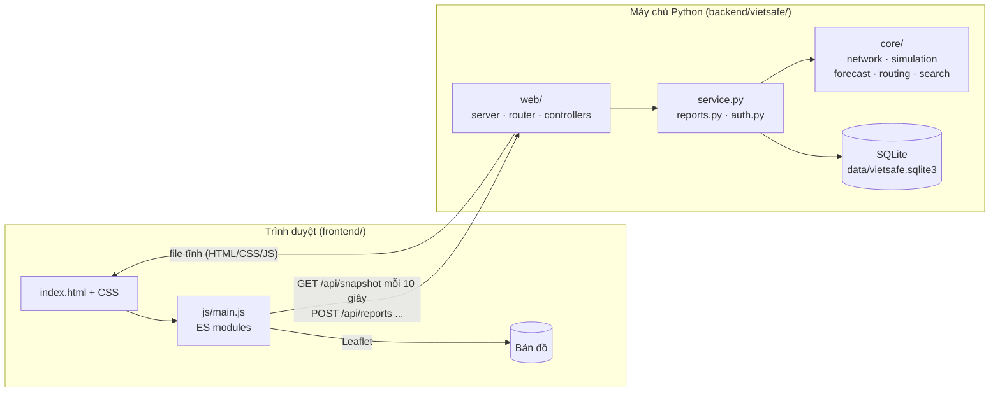
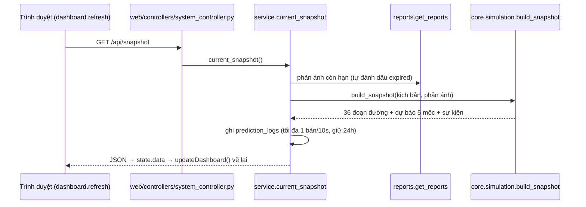
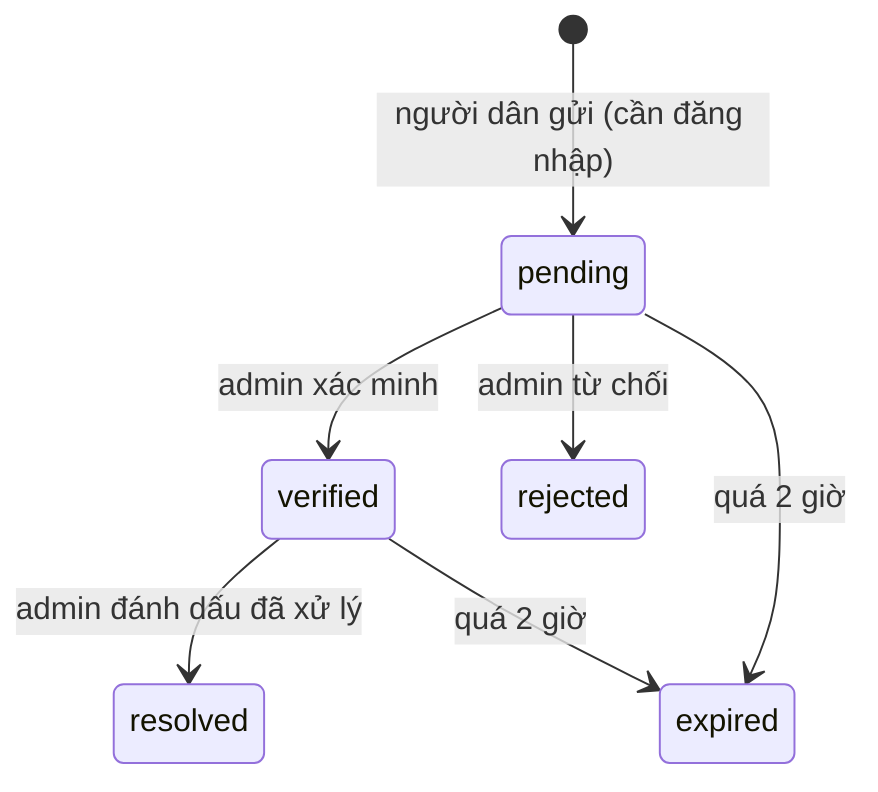

# Kiến trúc

Tài liệu này mô tả VietSafe được tổ chức thế nào và **vì sao**. Đọc trước khi sửa code ở nhiều nơi.

## 1. Tóm tắt

VietSafe là một ứng dụng web 2 phần nói chuyện qua REST/JSON:



- **Một tiến trình duy nhất** phục vụ cả API lẫn file giao diện (`ThreadingHTTPServer` của thư viện chuẩn).
- **Không có bước build, không có thư viện ngoài** ở thời điểm chạy. `ruff` (backend) và các gói trong `package.json`
  (Prettier, ESLint, jsdom) chỉ để format, lint và test.
- **Trạng thái nằm ở SQLite**: phản ánh, tài khoản, phiên đăng nhập, kịch bản hiện hành, nhật ký dự báo.
  Mạng đường (25 nút, 36 đoạn) là dữ liệu tĩnh trong code (`core/network.py`).

## 2. Cấu trúc thư mục

```
backend/vietsafe/
├── __main__.py        Điểm vào:  python -m vietsafe
├── app.py             init_app(): tạo DB + tài khoản demo
├── config.py          Hằng số, đường dẫn, biến môi trường  ← nơi duy nhất đặt cấu hình
├── db.py              connect() + SCHEMA                    ← hạ tầng lưu trữ
├── auth.py            Mật khẩu, phiên, đăng nhập/đăng ký
├── reports.py         Phản ánh: tạo / duyệt / liệt kê / CSV
├── service.py         get/set_scenario, current_snapshot, prediction_logs
├── core/              ← LOGIC THUẦN: không biết gì về HTTP hay cơ sở dữ liệu
│   ├── network.py     25 nút, 36 đoạn đường, nearest_road()
│   ├── simulation.py  build_snapshot(): dữ liệu quan sát GIẢ LẬP theo kịch bản
│   ├── forecast.py    forecast(): công thức dự báo quy tắc
│   ├── routing.py     calculate_routes(): Dijkstra có phạt rủi ro
│   └── search.py      search_places(): tìm tên, bỏ dấu tiếng Việt
└── web/               ← TẦNG HTTP
    ├── server.py      Handler: kiểm tra Host/Origin, đọc body, gắn security header
    ├── router.py      Router + Request/Response + phân quyền (auth="admin"...)
    ├── controllers/   Các endpoint, mỗi file một nhóm chức năng (mỗi endpoint một hàm có decorator)
    │   ├── system_controller.py   /api/health, /api/snapshot, /api/search, /api/routes
    │   ├── auth_controller.py     /api/auth/login, register, logout, me
    │   ├── report_controller.py   /api/reports, /api/reports/{id}, /api/report-media/{id}
    │   └── admin_controller.py    /api/scenario, /api/export/predictions, /api/export/reports
    ├── ratelimit.py   Giới hạn tốc độ theo IP (cửa sổ trượt, trong bộ nhớ)
    └── static.py      Phục vụ frontend/, chặn path traversal

frontend/
├── index.html         Khung mọi trang (section.view) + hộp thoại + thư viện icon SVG
├── css/               Các file theo khu vực giao diện; THỨ TỰ NẠP trong index.html có ý nghĩa
├── js/                main.js, state.js, api.js, map.js, auth.js, views/*, data/*  (xem docs/FRONTEND.md)
└── vendor/            Leaflet 1.x nạp cục bộ (không phụ thuộc CDN)
```

### Quy tắc phụ thuộc giữa các lớp

```
web/controllers/  ──►  service.py, reports.py, auth.py  ──►  core/ , db.py
```

- `core/` **không import** `web/`, `db.py` hay `service.py` → test được mà không cần server hay DB.
- `web/controllers/*` chỉ **điều phối** (đọc request, gọi service, trả response); không chứa SQL hay công thức.
- `server.py` lấy bảng route qua `from .controllers import router`. Decorator chỉ đăng ký route khi module controller được import,
  nên mọi controller phải được nạp trong `web/controllers/__init__.py`.
- Mọi hằng số có thể muốn chỉnh nằm ở `config.py`, không rải rác.

Quy tắc này là lý do code dễ thay phần ruột: ví dụ thay bộ mô phỏng bằng dữ liệu thật chỉ đụng
`core/simulation.py` và `service.py`, còn API và giao diện giữ nguyên (xem
[BACKEND.md](BACKEND.md#thay-dữ-liệu-mô-phỏng-bằng-dữ-liệu-thật)).

## 3. Luồng dữ liệu

### 3.1. Vòng cập nhật bản đồ (mỗi 10 giây)



Snapshot là **hàm thuần của (kịch bản, phản ánh đã xác minh, thời gian)**; backend không giữ trạng thái
"đoạn đường hiện đang ngập" nào ngoài kịch bản và phản ánh. Điều này giúp test xác định (`now` truyền vào được).

### 3.2. Vòng đời một phản ánh



**Quy tắc cốt lõi (có test):** chỉ phản ánh `verified` và còn hạn mới làm đổi trạng thái đường (đoạn bị chặn)
và kết quả định tuyến. Phản ánh `pending` chỉ hiện dạng "chờ xác minh", không ảnh hưởng gì khác.
Mọi chuyển trạng thái của admin được ghi vào bảng `audit`.

### 3.3. Vòng đời một request HTTP

1. `web/server.py` kiểm tra **Host**: chỉ chấp nhận `localhost:<cổng>` / `127.0.0.1:<cổng>` và các tên miền có hậu tố trong
   `ALLOWED_HOST_SUFFIXES` (tunnel/hosting). Sai Host → 403.
2. Với POST: kiểm tra thêm **Origin** cùng nguồn (nếu có) và header **`X-VietSafe: local`** (chống CSRF) → 403 nếu sai; giới hạn
   kích thước body (2,2 MB, quá lớn hoặc trống → 413); parse JSON (phải là object).
3. `router.match(method, path)` tìm endpoint → `authorize()` kiểm tra quyền khai báo trên decorator (401 chưa đăng nhập, 403 thiếu quyền).
4. Gọi hàm endpoint. Lỗi nghiệp vụ → HTTP 400 kèm thông báo: GET bắt `ValueError`/`TypeError`, POST bắt thêm `KeyError`/`UnicodeDecodeError`
   (JSON hỏng cũng là `ValueError`). Lỗi khác → 500 thông báo chung, chi tiết in ra console máy chủ. Đường dẫn `/api/*` không có route → 404.
5. Ghi phản hồi kèm security header (CSP, nosniff, X-Frame-Options, Referrer-Policy...).
6. Đường dẫn không phải `/api/*` → phục vụ file tĩnh từ `frontend/` (HEAD được xử lý như GET).

## 4. Quyết định thiết kế

| Quyết định                                                         | Lý do                                                                                   |
| ------------------------------------------------------------------ | --------------------------------------------------------------------------------------- |
| Chỉ dùng thư viện chuẩn Python                                     | Chạy được ngay trên máy bất kỳ (kể cả máy thi), Docker nhỏ, không rủi ro chuỗi cung ứng |
| Frontend thuần HTML/CSS/ES modules, không framework, không build   | App nhỏ; `<script type="module">` chạy trực tiếp và tương thích CSP `script-src 'self'` |
| Snapshot tính lại mỗi request (không cache trạng thái)             | Đơn giản, xác định, dễ test; chi phí rất nhỏ với 36 đoạn đường                          |
| Kiểm duyệt phản ánh trước khi có hiệu lực                          | Dữ liệu cộng đồng không đáng tin mặc định; tránh chặn đường oan                         |
| Đoạn đường thiếu dữ liệu: dự báo trả `null`, không bịa số          | Trung thực với người dùng; định tuyến loại các đoạn `known=false`                       |
| `core/` tách khỏi HTTP/DB                                          | Thay mô hình/nguồn dữ liệu mà không đụng phần còn lại; test nhanh                       |
| Controller tách theo nhóm chức năng, khai báo quyền trên decorator | Dễ tìm endpoint; không có `if user is None` rải rác                                     |
| Mọi chuỗi động qua `esc()` trước khi vào `innerHTML`               | Chống XSS vì giao diện dựng bằng template string                                        |

## 5. Mô hình an ninh

**Đã có**

- Host allowlist; CORS không mở (không có header `Access-Control-*`); POST yêu cầu `X-VietSafe` + Origin hợp lệ.
- CSP chặt: `script-src 'self'` → **cấm script/handler nội tuyến** (`onclick="..."`); `connect-src 'self'`; ảnh bản đồ chỉ từ
  Stadia Maps và OpenStreetMap.
- Phiên đăng nhập là token ngẫu nhiên 256 bit lưu ở DB, hạn 24 giờ; frontend gửi qua header `X-VietSafe-Session`
  (token lưu ở `localStorage` của trình duyệt).
- Ảnh phản ánh: chỉ JPG/PNG/WebP, ≤ 1,5 MB, kiểm tra **chữ ký file** (không tin MIME khai báo); không dùng SVG.
- Xuất CSV chống formula injection; giới hạn 10 phản ánh/phút/IP; chống gửi trùng trong 5 phút; vị trí phản ánh phải nằm trong
  vùng thử nghiệm và cách mạng đường không quá 1 km.
- Phân quyền kiểm tra ở backend (`auth="user"` / `auth="admin"`); việc ẩn nút ở frontend chỉ là UX.

**Giới hạn đã biết (chưa đạt chuẩn vận hành thật)**

- Mật khẩu băm SHA-256 không salt (`auth.py`); khi nâng cấp nên chuyển sang `scrypt`/PBKDF2 có salt và băm lại ở lần đăng nhập kế tiếp.
- Hai tài khoản demo có mật khẩu mặc định công khai trong README; đổi bằng biến môi trường trước khi tạo DB.
- Đăng nhập chưa giới hạn số lần thử. Giới hạn tốc độ chỉ áp dụng cho gửi phản ánh, đếm theo IP kết nối trực tiếp (không đọc
  `X-Forwarded-For`) nên sau proxy/tunnel nhiều người dùng có thể chung một IP; bộ đếm nằm trong bộ nhớ, mất khi khởi động lại.
- `GET /api/reports` và `GET /api/report-media/{id}` công khai: ai cũng đọc được danh sách phản ánh (kể cả chờ xác minh/bị từ chối,
  tọa độ, mô tả) và ảnh đính kèm.
- Máy chủ chỉ nói HTTP; HTTPS dựa vào tunnel/hosting phía trước.
- Không có hệ thống migration cho SQLite.

## 6. Dữ liệu thật và dữ liệu giả lập

- **Giả lập:** toàn bộ quan sát theo đoạn đường (tốc độ, độ sâu ngập, sự kiện nền) do `core/simulation.py` sinh ra từ kịch bản thời tiết
  (`normal` 0 mm/h, `rain` 28 mm/h, `storm` 55 mm/h), cộng một dao động nhỏ theo thời gian. Mạng đường là đồ thị giản lược dựng tay.
- **Quy tắc, không phải AI đã huấn luyện:** `core/forecast.py` là công thức quy tắc (`MODEL_VERSION = "spatial-rule-demo-1.0"`);
  điểm nguy cơ không phải xác suất đã hiệu chỉnh.
- **Dữ liệu từ người dùng:** phản ánh cộng đồng đã được admin xác minh là nguồn duy nhất không do bộ mô phỏng tạo ra.
- **Chưa kết nối:** dữ liệu mưa, mực nước, camera, cơ quan khí tượng/thoát nước. `/api/snapshot` trả sẵn `source_notice` và
  `forecast_notice` để giao diện hiển thị đúng thực tế này.
- **Nhật ký dự báo:** mỗi 10 giây một bản ghi vào `prediction_logs` (giữ 24 giờ) để sau này đối chiếu với quan sát thật.
