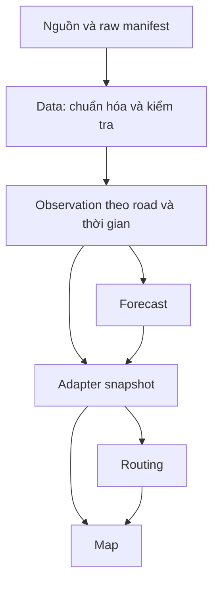

# Module Data — Data Contract và kiến trúc Data-02

**Contract: draft v0.1.0, chưa nối vào runtime web.** Data-02 đã có package offline,
semantic validator, demo pipeline và kiểm thử; xem [mục 12](#12-data-02--implementation-offline).
Các quyết định graph/timestep/target vận hành vẫn chờ nhóm Forecast duyệt.
Ngày review: 2026-10-08. Mục 1–11 giữ bối cảnh và thiết kế Data-01; mục 12 mô tả implementation hiện tại.
Một đoạn đường + một thời điểm = một observation. JSON Schema và ví dụ:
[road-observation.schema.json](schemas/road-observation.schema.json),
[road-observation.example.json](examples/road-observation.example.json).
Định nghĩa từng trường: [DATA_DICTIONARY.md](DATA_DICTIONARY.md).

## 1. Phạm vi và bằng chứng kiến trúc

Data chịu trách nhiệm chuẩn hóa định danh, không gian, thời gian, đơn vị, nguồn gốc và
chất lượng để Forecast, Routing, Map dùng chung. Data-01 chỉ thiết kế hợp đồng;
không tạo collector, đọc NASA/OSM, tải dataset, huấn luyện hoặc thay API.

Đã khảo sát toàn bộ cây file và các branch tại thời điểm đọc:

| Baseline | Nội dung có thật |
| --- | --- |
| `main@d98f8da6d74cdf25142530dfdd56666cb1331a22` | `README.md`, `network.py`, `engine.py`, `server.py`, `public/`, `tests/`, tài liệu DOCX trong `docs/`; chưa có package `core/` hay ARCHITECTURE/BACKEND Markdown |
| `init_folder_structure@9734fb36c6896346ad0bac5c7feebfc7c4392f7b` | `docs/ARCHITECTURE.md`, `docs/BACKEND.md`, `docs/DEVELOPMENT.md`; package `backend/vietsafe/`, `frontend/` cùng các file tương thích cũ |
| `TaiNguyen@2e70546f7b09d32ced4853c739c32ec024ea1aa2` | Cây file có thêm frontend enhancements và `public/tgcn.js`; không phải baseline runtime của task này |
| `AnhQuan_map`, `ungcuu_phananh` | Cùng head với `main` ở lần khảo sát |

Đọc README của cả main và branch cấu trúc; đọc kỹ network, simulation, forecast,
routing, service, reports, db, config, system controller và các consumer Map/Forecast/Routing.
Quy ước `docs/<mô-tả>` ở DEVELOPMENT được dùng cho branch `docs/data-module`,
tạo từ main; không gộp commit tái cấu trúc của nhóm khác.
Các đường dẫn `backend/...` dưới đây là **điểm tích hợp dự kiến trên branch cấu trúc**,
không khẳng định chúng đã tồn tại trên main.

### Luồng hiện tại đã đối chiếu với code

- `network.py` (hoặc `core/network.py`): 25 nút, 36 đoạn dựng tay;
  `HN-001`... sinh từ vị trí `EDGE_ROWS`, không phải OSM ID.
- `server.snapshot()` (hoặc `service.current_snapshot()`): đọc scenario và reports,
  gọi `engine.build_snapshot()` (hoặc `core/simulation.build_snapshot()`).
- Mô phỏng sinh speed km/h, depth cm và rainfall **cường độ mm/h**, dao động mỗi 10 giây.
  Chỉ report `verified`, `expires_at > now` tác động trạng thái. Report không đo depth;
  severity không phải phép đo cm. Đường unknown vẫn có số mô phỏng nhưng không dùng để dự báo.
- `forecast(road, current, neighbor_speed, rain, horizon)` là quy tắc
  `spatial-rule-demo-1.0`, chưa phải T-GCN. Dự báo tại 0/15/30/45/60 phút.
- Routing Dijkstra tạo cạnh hai chiều từ `a,b`, bỏ `blocked` hoặc `known=false`;
  dùng forecast tại thời điểm đến làm tròn lên, giới hạn 60 phút. Điểm nguy cơ
  82 (xe máy)/88 (ô tô) loại cạnh. `depth >= 30` cm hoặc report severity 3
  có thể chặn đường trong demo. Đây là chính sách hiện tại, không phải chuẩn an toàn mới.
- Map đọc snapshot và route response độc lập: `roads[].id`, `coordinates` theo
  **[latitude, longitude]**, `forecast[]` đánh chỉ số `horizon/15`, `known`, `blocked`.
  Report và route đều tham chiếu cùng road ID. Map không gọi NASA hay T-GCN trực tiếp.

Vì vậy chuỗi `Data -> Forecast -> Routing -> Map` là luồng phụ thuộc; Map cũng nhận
trực tiếp observation/event qua snapshot, không chỉ nhận kết quả Routing.

## 2. Kiến trúc dữ liệu dự kiến (chưa triển khai)



MVP dùng file/schema và manifest phiên bản hóa, chưa cần Kafka, feature store hay DB mới.
I/O của Data và collector sau này ở ngoài logic thuần `core/`; service điều phối adapter.
Road registry giữ geometry/topology một lần; observation không lặp toàn bộ polyline.

| Loại | Nội dung | Cách lưu logic dự kiến |
| --- | --- | --- |
| Static / slowly changing | Geometry, OSM lineage, endpoints, elevation, slope, TWI, free-flow speed | Road registry bất biến theo `network_version`; giá trị join vào observation |
| Dynamic | Mưa theo cửa sổ, soil moisture, traffic speed, độ sâu ngập | Một observation/road/timestep trong mỗi dataset release |
| Event | Report, xác minh, incident, đóng/mở, thời điểm hết hạn | Sổ sự kiện riêng; phép join as-of, không nhét ảnh/người gửi vào observation |
| Historical aggregate | Số đợt ngập đã xác minh trong 365 ngày | Feature dẫn xuất theo cutoff; không phải static vĩnh viễn |

`dataset_version` xác định một release bất biến, có manifest ghi source IDs/checksum,
product/run/version, license, thời gian tải, vùng lấy dữ liệu, CRS/resolution, code commit,
tham số chuyển đổi, quy tắc alignment/QC và danh sách road registry. Không tạo manifest
hay dataset thật trong Data-01. Release mới không ghi đè release đã dùng để đánh giá.

## 3. Data Contract v0.1.0

Tất cả top-level field trong schema phải có mặt. Feature được phép `null`; field thiếu
hẳn là record không hợp lệ. Giữ nguyên 18 tên field người phụ trách đề xuất, bổ sung:

- `schema_version`: phiên bản hợp đồng, hiện `0.1.0` (draft).
- `dataset_version`: release bất biến, phân biệt backfill/correction.
- `network_version`: registry/topology/geometry bất biến.
- `as_of`: knowledge cutoff dùng để dựng record; khác `timestamp`.
- `data_mode`: `observed` hoặc `demo`; không trộn giá trị mô phỏng vào observed.
- `quality_flags`: lý do thiếu hoặc hạn chế theo feature.

Trong mỗi dataset release chỉ có **một** dòng cho `(road_id, timestamp)`;
`network_version` duy nhất trong release. Khóa lưu nhiều release là
`(dataset_version, road_id, timestamp)`. Source không tạo dòng observation thứ hai.
Cùng raw bytes + cùng registry + cùng config/code phải sinh cùng release content.
Hai phiên bản nguồn khác nhau cho một cửa sổ không được cộng hai lần; thứ tự ưu tiên
product/run và xử lý conflict phải đóng băng trong manifest.

Quy ước tên: `snake_case`, tiếng Anh, JSON UTF-8, số JSON hữu hạn; không đổi tên để
trông giống API cũ. Đơn vị nằm trong dictionary/schema và không thay đổi theo record.
ID luôn là string để tránh mất chính xác số nguyên lớn khi qua JavaScript.
Thay đơn vị, ý nghĩa khóa hoặc null policy là breaking change; cần phiên bản schema mới.
Consumer phải chọn rõ schema version, không bỏ qua field lạ im lặng.

## 4. Quy tắc road_id

| Phương án | Đánh giá |
| --- | --- |
| OSM way ID đơn lẻ | Có lineage tốt nhưng một way có nhiều đoạn/giao lộ; không phân biệt hai hướng hoặc vòng lặp |
| Edge index / `(u,v,key)` của thư viện | Thuận tiện nội bộ; index/key có thể thay khi thứ tự import/simplification đổi; không đủ làm khóa trao đổi |
| Stable composite ID | **Chọn cho OSM contract đề xuất**: namespace + way ID + hai mốc phân đoạn + dấu vân tay đường đi + hướng |

Đề xuất cụ thể cho segment OSM có hướng:

`osm:v1:<way_id>:<u>:<v>:<path_sha256>:<f|r>`

1. Phân đoạn tại giao lộ định tuyến và ranh giới thuộc tính có ảnh hưởng lưu thông;
   quy tắc split phải version hóa. V1 không gộp nhiều way vào một segment.
2. Với chuỗi OSM node ID của segment, so sánh **tuple số nguyên** với tuple đảo;
   chọn tuple nhỏ hơn làm canonical path. `u,v` là phần tử đầu/cuối canonical path.
3. Chuỗi hash chính xác: `way=<way_id>;nodes=<id1>,<id2>,...` dùng số thập phân
   không leading zero, ASCII/UTF-8, không khoảng trắng/newline; SHA-256 đủ 64 ký tự hex thường.
4. `f` đi theo canonical path, `r` đi ngược. Chỉ phát hành hướng hợp lệ theo nguồn.
   Way vòng kín phải split ở các nút anchor ổn định; nếu một chuỗi node giống hệt xuất hiện
   nhiều lần trong cùng way hoặc split không xác định duy nhất, quarantine để xử lý,
   không thêm counter tùy thứ tự nhằm che collision.
5. Registry lưu `osm_way_id`, canonical node sequence, OSM snapshot/version, endpoints,
   direction, geometry, length, lineage và mapping sang edge của graph. Collision check
   ID -> đúng một payload; SHA-256 không thay thế bước kiểm tra duy nhất.
6. Cùng topology/node sequence/direction giữ ID qua lần import, đổi tên đường hoặc chỉnh
   tọa độ node không đổi ID nhưng đổi `network_version`. Split/merge/chuyển way làm đổi
   lineage thì tạo ID mới, lưu predecessor/successor mapping; không hứa ổn định vĩnh viễn
   qua mọi lần biên tập OSM. Không đưa timestamp tải hay số thứ tự hàng vào ID.

**Tương thích demo:** giữ nguyên `HN-001`...`HN-036` trong API và reports.
Observation draft cho demo chấp nhận các ID đó khi registry namespace là `hanoi-demo-*`;
cố định mapping theo baseline, không tái đánh số nếu sắp xếp lại danh sách. Chúng là
segment hai chiều của demo, không giả làm OSM. Không tự động map một HN-ID sang một way:
đoạn demo có thể tương ứng nhiều segment thật; cần crosswalk có review và version.

**Điểm cần nhóm duyệt trước khi triển khai:** ID có hướng cho OSM và đồ thị T-GCN theo
segment sẽ ảnh hưởng số phần tử, adjacency, mapping reports và Routing hiện đang hai chiều.
Đây chỉ là thiết kế đề xuất; Data-01 không thay graph, ROADS, nearest_road hay DB.
Routing và Map nên xem `road_id` là opaque ID, không parse tên đường từ khóa.

## 5. Timestamp và temporal alignment

- Canonical JSON: UTC, ISO 8601/RFC 3339, giây nguyên, hậu tố `Z`:
  `2026-10-08T02:30:00Z` tương đương `2026-10-08T09:30:00+07:00`.
- Hiển thị Việt Nam: `Asia/Ho_Chi_Minh`. Input phải có offset; không đoán timezone
  cho datetime naive. Adapter sẽ giữ Unix seconds ở API hiện tại, không thay wire format.
- **Đề xuất** timestep Data 30 phút, tại `:00`/`:30`; timestamp là cuối cửa sổ.
  Cửa sổ dùng `(t-duration,t]`, chuẩn hóa interval bounds từ product gốc trước khi cộng.
  Không thay poll 10 giây hay horizon 15 phút của demo. Nhóm Forecast phải duyệt bước
  30 phút và cách cung cấp mốc +15/+45; không tự nội suy thành dự báo đã được kiểm chứng.
- `as_of >= timestamp`: chỉ chọn input có `source.available_at <= as_of`;
  `observed_at <= timestamp`. `available_at` là lúc dữ liệu/phiên bản đó sẵn dùng cho
  hệ thống (không sớm hơn công bố và ingest; report không sớm hơn lúc xác minh).
  Manifest lưu riêng published/retrieved timestamps nếu có, không sửa event time thành ingest time.
- `source.observed_at` là thời điểm đo cuối cùng đóng góp; nhiều granule/cửa sổ và
  timestamp từng input phải truy được qua `record_ref`. `valid_until` dùng cho TTL,
  hết hạn khi `timestamp >= valid_until`; static có thể `null` dưới registry bất biến.
- Record backfill với `as_of > timestamp` hợp lệ cho mô tả lịch sử nhưng **không mặc nhiên
  hợp lệ cho backtest dự báo tại timestamp**. Mỗi training sample phải dựng lại as-of
  đúng forecast issue time; mọi nguồn của input phải available trước issue time.

| Nguồn | Chu kỳ / quy tắc đề xuất |
| --- | --- |
| GPM IMERG | Product half-hourly; đọc unit/scale/fill values. Nếu rate mm/h, tích phân `rate * 0.5` cho bin đủ 30 phút; rainfall_1h/3h là tổng 2/6 bin không trùng. Thiếu bin -> null toàn cửa sổ đó, không zero-fill, không forward-fill mưa |
| SMAP | Chu kỳ phụ thuộc product: ví dụ L3 daily composite, không phải đo mới mỗi 30 phút. Join giá trị gần nhất trong quá khứ, giữ measurement time; đề xuất carry-forward tối đa 72h cho surface L3, cần duyệt theo product/QC |
| Traffic | Dùng trung bình có trọng số thời gian trong 30 phút, không trung bình tùy số request. Đề xuất coverage >= 80%, gap cuối <= 10 phút; thiếu -> null. Không lấy tốc độ giới hạn làm tốc độ quan sát |
| Community | Event không đều; giữ nguyên thời gian gốc. Chỉ verified và còn hạn tại cutoff mới ảnh hưởng observation; cần audit để biết trạng thái tại cutoff, không dùng trạng thái hiện tại hồi tố |
| DEM/OSM | Pin snapshot/version; không biến dữ liệu tĩnh thành đo mới mỗi timestep |

NASA mô tả IMERG Early trễ khoảng 4h, Late khoảng 14h; half-hourly không có nghĩa dữ
liệu sẵn có trong 30 phút. Không dùng GPM Final hồi tố làm input "real-time" không có
availability gate. Kế hoạch dự báo 30–60 phút cần nhóm cân nhắc nguồn mưa độ trễ thấp
hoặc dùng GPM làm biến lịch sử. Không chọn nguồn mới, triển khai nowcast hay đổi model ở đây.

## 6. Spatial alignment và ý nghĩa feature

- Latitude/longitude là điểm giữa **theo chiều dài** của polyline segment trong registry,
  WGS84/EPSG:4326, không phải vị trí pixel NASA hay điểm report.
- Geometry đầy đủ nằm trong registry. GeoJSON dùng `[longitude, latitude]`; adapter
  Leaflet hiện tại dùng `[latitude, longitude]`. Không trộn thứ tự tọa độ.
- Phép đo độ dài, slope, DEM sampling dùng CRS theo mét phù hợp vùng; manifest ghi CRS,
  resolution, nodata, resampling, aggregation, buffer và datum. Không tính slope từ độ lat/lon.
- Rainfall và soil moisture là proxy từ grid cho segment, không phải phép đo riêng
  tại mỗi mặt đường. Ghi pixel/granule và mapping method trong lineage; không tuyên bố
  tăng độ phân giải vì nhiều road cùng lấy một pixel.
- `elevation`: cao độ terrain đại diện segment, mét theo EGM96; không mặc nhiên là mặt
  cầu/đường. Khác vertical datum phải chuyển đổi có ghi nhận hoặc null.
- `slope`: độ dốc terrain, đơn vị độ (không %); `twi`: chỉ số tương đối
  `ln((a / 1 m) / tan(beta))`, a là diện tích góp nước riêng trên đơn vị bề rộng (m),
  beta radian trong phép tính. Thuật toán flow, epsilon vùng phẳng, DEM conditioning và
  phép lấy đại diện segment phải pin trong manifest. TWI có thể âm, không giới hạn 0..1.
  DEM/bridge/tunnel có thể không đủ đại diện ngập đường: flag `proxy`, không giả thành sensor.
- `historical_flood_count`: số **đợt ngập phân biệt** đã xác minh trong `(t-365d,t)`;
  không đếm số report lặp. Chỉ phát hành khi có catalog/window coverage đầy đủ và quy tắc
  event dedup/version trong manifest. Chưa có catalog thì null, không suy ra 0 từ im lặng.
- `current_flood_depth`: cm trên mặt đường tại vị trí đại diện được mô tả trong lineage.
  `flood_status=true` có bằng chứng ngập; false cần bằng chứng khô, null là không biết.
  Nếu có depth: >0 -> true; =0 -> false. True có thể đi với depth null (report xác minh
  không đo được độ sâu). Severity hoặc flood_risk không được đổi thành depth/label đo thật.
  Nhiều bằng chứng trái nhau chưa phân xử -> null và flag conflict, không tự trung bình.

## 7. Missing value và data quality policy

| Giá trị | Ý nghĩa |
| --- | --- |
| `null` | Chưa có / hết hạn / bị QC loại / conflict; phải có quality flag theo feature |
| `NaN`, Infinity, sentinel `-9999` | Không hợp lệ trên JSON boundary; chuẩn hóa sang null + lý do, raw vẫn giữ để audit |
| `unknown` | Trạng thái nghiệp vụ suy ra từ null; không đưa chuỗi này vào số/boolean |
| `0` / `false` | Quan sát hợp lệ: 0 mm mưa, xe đứng yên 0 km/h, 0 cm đã xác nhận khô; không có nghĩa missing |
| Field bị bỏ | Vi phạm schema; không tương đương null |

`source` là danh sách metadata **theo nhóm feature cùng provenance**; mỗi feature
không null (kể cả latitude/longitude) xuất hiện đúng một lần trong `source[].fields`.
Feature null không gán nguồn hợp lệ; nguồn bị loại có thể ghi trong raw manifest,
và lý do trong quality_flags. Một feature dẫn xuất từ nhiều input dùng một `record_ref`
trỏ lineage manifest chứa toàn bộ inputs, không làm mất nguồn bằng nhãn "mixed".
Mỗi nguồn ghi provider, product, version, record_ref, observed_at, available_at,
valid_until, method. NASA GPM/SMAP, NASADEM/SRTM, OSM, traffic provider, verified community
và demo có namespace riêng. Không ghi token, thông tin đăng nhập hay thông tin cá nhân.

### quality_score: chính sách sơ bộ `coverage-v0.1`

12 feature được tính điểm: rainfall_30m, rainfall_1h, rainfall_3h, soil_moisture,
elevation, slope, twi, traffic_speed, free_flow_speed, historical_flood_count,
current_flood_depth, flood_status. Mẫu số cố định **12** trong v0.1.0.
Latitude/longitude là khóa không gian bắt buộc, không tính vào điểm feature.

Với mỗi trong 12 feature: null hoặc simulated -> 0; giá trị có provenance hợp lệ,
qua range/QC/availability/TTL, method measurement/aggregate/derived -> 1;
carry_forward hoặc imputed -> 0.5. `quality_score = round(sum(weights) / 12, 4)`.
Score của record demo toàn mô phỏng là 0, dù JSON hợp lệ. Điểm 1 thể hiện đầy đủ
và đạt checks đã khai báo, **không** là xác suất đúng hoặc xác suất không ngập;
chưa chấm độ tin cậy vật lý/độ phân giải sensor. Score thấp không chứng minh nguy hiểm,
score cao không chứng minh an toàn. Feature count cố định tránh tăng điểm bằng cách bỏ field.

Một số checks là lỗi reject toàn record: sai schema/ID/time/unit, thiếu lineage,
trùng khóa, sai version, NaN. Lỗi feature có thể quarantine giá trị, xuất null + flag
nếu identity/time vẫn hợp lệ. Cross-field checks bắt buộc:

1. Rainfall cùng nguồn/quy trình và đủ coverage: `0 <= rainfall_30m <= rainfall_1h <= rainfall_3h`.
2. Free-flow >0; traffic_speed=0 hợp lệ và traffic có thể lớn hơn free-flow, không tự clip.
3. Depth/status nhất quán, không coi unknown là dry. Feature có giá trị null phải có flag
   `missing`, `stale`, `rejected` hoặc `conflict`.
4. Tính lại quality_score; kiểm tra sources cover đúng non-null features không trùng,
   dates/TTL, record_ref truy được, tọa độ khớp registry và uniqueness trong release.
5. `data_mode=observed` cấm provider demo/method simulated; `demo` chỉ chứa nguồn demo,
   method simulated. Không dùng demo làm nhãn ground truth thật.

JSON Schema kiểm tra cấu trúc, range, UTC format, grid timestamp và depth/status; các quan hệ khác,
lineage resolution, score, uniqueness dataset và as-of do semantic validator Data-02 kiểm tra.
Không tuyên bố JSON Schema tự kiểm tra được mọi quy tắc trên.

## 8. Đầu ra cho Forecast và T-GCN

Observation giữ đơn vị vật lý, chưa normalize; tách dự báo khỏi observation để tránh
circular labels. Dataset export sau này gồm observations, registry, manifest và masks.
Không train bằng prediction_logs/risk của demo như nhãn ngập thật.

**Đề xuất chờ Forecast duyệt:** mỗi directed road segment là một phần tử graph học
(line graph của mạng đường); các phần tử nối nhau theo kết nối lưu thông hợp lệ.
Không lấy adjacency 25 nút giao rồi ghép với 36 feature đoạn đường. Nếu nhóm chọn
intersection graph, phải định nghĩa phép tổng hợp segment -> node riêng, không tự đổi contract.

- Manifest lưu `road_ids` theo thứ tự cố định, `feature_names`, `network_version`,
  `schema_version`, timestep, windows, horizons, CRS, masks, scaler và split policy.
- Đề xuất `X[B,T,N,F]`, `X_mask` cùng shape; `A[N,N]` cùng thứ tự road_ids;
  `Y[B,H,N,K]`, `Y_mask` tách nhãn. Chưa chốt T/F/K hoặc adjacency normalization.
- Giữ null trong canonical; tensor có thể dùng NaN/mask, chỉ fill sau khi tạo mask.
  Imputation/scaler fit trên train; validation/test split theo thời gian hoặc sự kiện,
  tránh cửa sổ chồng lấn qua ranh giới bằng purge phù hợp lookback/horizon.
- Target tương lai chỉ khi thực sự đo/xác minh, thiếu target -> Y_mask=0.
  Input phải thỏa as-of forecast issue time; không dùng report được duyệt sau thời điểm đó.
  Phiên bản nguồn Final/backfill không được âm thầm thay Early ở backtest vận hành.

**Các quyết định cần xác nhận trước tích hợp:** timestep 30 phút; graph directed/segment;
lookback, labels và forecast horizons; missing/quality gates; latency nguồn mưa.
Tất cả dừng ở mức đề xuất trong Data-01; không sửa forecast signature/model_version.

## 9. Đầu ra Routing và cách Map sử dụng

Hợp đồng canonical **không thay thế JSON `/api/snapshot` trực tiếp**. Adapter tương lai
join observation + registry + Forecast + event ledger; chưa triển khai trong task này.

| Canonical / registry | Snapshot/API hiện tại | Lưu ý adapter |
| --- | --- | --- |
| road_id | roads[].id, events[].road_id, routes[].road_ids | Demo giữ HN-ID; crosswalk OSM chỉ sau review |
| traffic_speed | speed | km/h; thiếu không điền 0 |
| free_flow_speed | free_speed | km/h; không tự suy từ speed limit |
| current_flood_depth | depth | cm, không đổi đơn vị; thiếu không điền 0 |
| timestamp + source.observed_at | updated_at | UTC -> Unix seconds; timestamp là bin, giữ thời gian đo gốc khi carry-forward; không dùng as_of để làm mới tuổi dữ liệu |
| registry geometry | coordinates, a, b, length_km, name | Lat/lon order cho Leaflet; điểm representative không thay geometry |
| source / quality_flags | sources / evidence, origin | Nhãn trung thực; không để demo mang nhãn dữ liệu NASA thật |
| forecast output | forecast[{horizon,flood_risk,speed,risk,label}] | Giữ 5 mốc và thứ tự; risk là chỉ số 0..100, chưa phải xác suất |

`known`, `blocked`, `incident`, `susceptibility`, `flood_risk`, `risk` không được bịa
chỉ từ observation mới. Baseline còn cần susceptibility và current risk/incident,
mưa intensity chứ không phải accumulation: nếu muốn dùng `rainfall_30m / 0.5` phải
đặt tên rõ mean rate của nửa giờ, kiểm tra đủ coverage và được Forecast duyệt.
Không truyền trực tiếp mm vào tham số mm/h. Quy tắc suy susceptibility/risk chưa chốt.
Do đó schema mới chưa đủ để drop-in thay build_snapshot; cần task adapter có kiểm thử riêng.

Routing tiếp tục bỏ unknown/blocked; **không** lấy `quality_score > 0` hay chỉ có speed
làm known=true. Các trường Forecast/Routing bắt buộc phải đủ theo policy model đã duyệt;
thiếu thì giữ known=false và dự báo null theo hành vi hiện có. Không thay threshold,
chi phí Dijkstra, horizon, auth hoặc report lifecycle. Event khẩn vẫn là luồng riêng,
không chờ resample 30 phút rồi mới được hiển thị/chặn theo cơ chế đang chạy.

Map join bằng ID, vẽ geometry registry, hiển thị thiếu dữ liệu và thời gian đo thật;
chỉ format giờ địa phương ở UI. Không suy null depth thành "không ngập" hoặc tự chạy
QC/forecast trong browser. Cách hiển thị mới nếu có là task Map/adapter về sau.

## 10. Kiểm chứng và lộ trình Data-02

Kiểm tra JSON bằng `python -m json.tool` và JSON Schema Draft 2020-12 với format checking.
Ví dụ chạy ở root repo, trong môi trường review riêng có `jsonschema==4.26.0` và
`rfc3339-validator==0.1.4` (thiếu plugin date-time có thể khiến format check bị bỏ qua):

```bash
python - <<'PYCODE'
import json
from pathlib import Path
from jsonschema import Draft202012Validator, FormatChecker
schema = json.loads(Path("docs/schemas/road-observation.schema.json").read_text())
record = json.loads(Path("docs/examples/road-observation.example.json").read_text())
checker = FormatChecker()
assert not checker.conforms("2026-02-30T02:30:00Z", "date-time")
Draft202012Validator.check_schema(schema)
Draft202012Validator(schema, format_checker=checker).validate(record)
print("Schema and example: OK")
PYCODE
```
Runtime repo vẫn chỉ cần Python standard library; validator JSON Schema là công cụ review
ngoài runtime, không thêm dependency vào requirements. Trước tích hợp phải có tests:
range/type/extra field, null vs zero, metadata coverage, ID determinism/reverse/parallel,
duplicate key, as-of/TTL, rainfall window coverage, depth/status, score và demo isolation.

Data-02 đề xuất: package Data tách I/O khỏi schema/validation, fixture/registry demo đóng
băng, semantic validator, manifest/version conventions và ranh giới adapter. Chỉ thiết kế
khung + test offline; OSM/DEM/GPM/SMAP vẫn để Data-03..06. Trước khi viết adapter/runtime,
nhóm Data + Forecast + Routing thống nhất các mục cần duyệt ở trên.

### Kết quả review Data-01 (lịch sử, không phải số test Data-02)

- `python -m unittest discover tests -v`: 17 tests đạt trên baseline main + docs mới.
- Chạy `tests/test_auth.py:main()` bằng harness trỏ `server.DB_PATH` sang SQLite tạm:
  13 kịch bản authentication/API đạt. Script này không phải unittest TestCase, nên không
  được tính trong 17 tests ở trên; không chạy nó trực tiếp trên DB làm việc.
- Harness review tạm: 48 checks đạt, gồm schema meta-validation, fixture, lỗi kiểu/range,
  ngày không tồn tại, UTC/grid, unknown vs zero/null, thiếu field, extra field, depth/status,
  demo isolation, finite JSON, provenance coverage, as-of/TTL, rainfall ordering, score,
  dictionary coverage, link nội bộ và tọa độ fixture demo.
- `git diff --cached --check`: đạt. Diff chỉ thêm 4 file trong docs; không sửa runtime.
- Harness tạm không phải semantic validator production. Chưa kiểm tra pipeline thật,
  OSM identity trên dữ liệu thật, tải nguồn, T-GCN, hoặc tích hợp schema mới vào API.
  Không chạy test của branch cấu trúc/JS smoke vì branch đó chưa được gộp và UI không đổi.

## 11. Nguồn tham khảo kỹ thuật

Đã đọc ngày 2026-10-08, không tải dataset. Đây là tham khảo product, không chốt product
version vận hành cho dự án:

- [NASA IMERG: đơn vị rate/accumulation, half-hourly và latency](https://gpm.nasa.gov/data/imerg).
- [NSIDC SMAP L3 daily surface soil moisture, Version 9](https://nsidc.org/data/spl3smp/versions/9)
  và [user guide](https://nsidc.org/sites/default/files/documents/user-guide/spl3smp-v009-userguide.pdf).
- [NASA Earthdata: NASADEM hgt, mét theo EGM96](https://forum.earthdata.nasa.gov/viewtopic.php?t=5916).
- Kiến trúc tham chiếu cố định:
  [ARCHITECTURE](https://github.com/sample126/VietSafe/blob/9734fb36c6896346ad0bac5c7feebfc7c4392f7b/docs/ARCHITECTURE.md),
  [BACKEND](https://github.com/sample126/VietSafe/blob/9734fb36c6896346ad0bac5c7feebfc7c4392f7b/docs/BACKEND.md),
  [DEVELOPMENT](https://github.com/sample126/VietSafe/blob/9734fb36c6896346ad0bac5c7feebfc7c4392f7b/docs/DEVELOPMENT.md).


## 12. Data-02 — implementation offline

### 12.1. Baseline và phạm vi

PR [#2](https://github.com/sample126/VietSafe/pull/2) **open, chưa merged** ở lần kiểm tra.
Baseline: `init_folder_structure@9734fb36c6896346ad0bac5c7feebfc7c4392f7b`.
Branch mới: `data/02-architecture`; cherry-pick Data-01 từ `9990bbacdfa8b7fede3180bca3539e599d062e38`.
Không merge PR #2, không sửa main và không đưa kiến trúc mới vào `docs/data-module`.

Baseline có một lỗi test: `backend/tests/helpers.py` import `report_limiter` từ file
`vietsafe.web.api` đã bị tách. Sửa đúng một import sang
`vietsafe.web.controllers.report_controller`; sau đó 51 test backend cũ pass.
Không sửa các hàm xử lý reports/rate limit/HTTP. Đây là thay đổi ngoài package Data duy nhất
ở Python cũ, cần để khôi phục test suite đúng kiến trúc baseline.

### 12.2. Module architecture và folder structure

| Đường dẫn trong `backend/vietsafe/data_pipeline/` | Trách nhiệm |
| --- | --- |
| `config.py` | DataPaths và các đường dẫn; import không tạo file/thư mục |
| `models.py` | RoadObservation, SourceMetadata, QualityFlag; JSON boundary, không ép kiểu/mất null |
| `registry.py` | RoadSegment, RoadRegistry, lookup, fingerprint và canonical JSON |
| `validation.py` | Cấu trúc v0.1.0 + semantic rules + dataset uniqueness; structured errors |
| `quality.py` | Feature lists, enum reasons/wire codes, policy coverage-v0.1 |
| `exceptions.py` | ValidationIssue, DataValidationError, ReleaseExistsError |
| `manifest.py` | Manifest, checksum, publication có khóa và chống overwrite |
| `adapters/demo.py` | Đọc mạng demo và tạo observation giả lập có provenance |
| `pipeline.py` | run_pipeline: registry → observation → validate → manifest → tùy chọn publish |
| `__main__.py` | CLI offline với input thời gian/version/commit tường minh |
| `ingestion/`, `processing/`, `features/` | Ranh giới mở rộng; hiện chỉ có `__init__.py`, chưa có collector/processing thật |

Các package có `__init__.py`; không thêm hook vào `service`, HTTP hay frontend.
Luồng tương lai: Raw → Ingestion → Processing/Alignment → Features → Validation → Release.
Data-02 chỉ thực thi adapter demo, validation và release; chưa có downstream adapter
cho Forecast/Routing/Map. Không gọi Forecast để tạo ground truth.

### 12.3. Data directories và config

`data/` có `raw/`, `interim/`, `processed/`, `manifests/`, `registry/`, `fixtures/`.
Dùng `.gitkeep`; fixture duy nhất là `data/fixtures/demo-request.json` có thời gian cố định.
Road registry demo được đọc qua adapter, không chép lại 36 đường vào fixture thứ hai.

Config hỗ trợ `DATA_ROOT`, `RAW_DIR`, `INTERIM_DIR`, `PROCESSED_DIR`, `MANIFEST_DIR`,
`NETWORK_REGISTRY_DIR`, `FIXTURE_DIR`. Mặc định root là `<repo>/data`, tính từ `__file__`
bằng pathlib. `VIETSAFE_DATA_ROOT` hoặc CLI `--data-root` đổi toàn bộ root;
`DataPaths.from_env()` đọc env ở lúc gọi. Relative override được resolve từ CWD.
Không đụng `VIETSAFE_DB` hoặc cấu hình của runtime web.

`DataPaths.ensure_directories()` chỉ gọi khi chủ động publish, không tự chạy lúc import.
Docker có thể dùng volume ghi được làm data root; chưa sửa Dockerfile và chưa chạy
kiểm thử trên Windows/Docker trong task này. Code dùng stdlib/pathlib và Python >=3.10.

Gitignore cho phép fixture JSON nhỏ, `registry/*.example.json`, `manifests/*.example.json`
và `.gitkeep`; bỏ qua raw/output/lock/staging cùng raster, Parquet, PBF, cache, `.env`,
credentials, private keys. Không commit file release do CLI sinh ra. JSON fixture vẫn cần
review kích thước/nội dung trước commit; gitignore không phải công cụ phát hiện secrets.

### 12.4. Road Registry

```python
from vietsafe.data_pipeline.adapters.demo import load_demo_registry
registry = load_demo_registry()
road = registry.get("HN-017")  # RoadSegment; ID không có -> None
```

Registry giữ `road_id`, `network_version`, `source_type`, `source_id`, `name`,
`coordinates` (lat,lon), `endpoint_a`, `endpoint_b`, `length_km`, `directionality`.
Dữ liệu demo đọc từ `core.network.ROADS`, giữ nguyên `HN-001`..`HN-036` và `both`.
Kiểm tra ID duy nhất, version đồng nhất, tên/lineage/endpoints không trống, length dương,
geometry hợp lệ/không suy biến và directionality. Lookup được index trong bộ nhớ;
copy sang tuple để không làm thay đổi lists của runtime.

`network_version = hanoi-demo-<16 ký tự SHA-256 của ROADS canonical>`; hiện là
`hanoi-demo-d1bfac3198c0f477`. Manifest giữ **đầy đủ** SHA-256 registry.
Test khóa version này: nếu mạng demo đổi phải review mapping/version và cập nhật test
có chủ đích. Sorting registry không đổi fingerprint. Registry abstraction hỗ trợ both,
forward, reverse nhưng Data-02 không tạo mạng có hướng hoặc adjacency T-GCN.
Điểm đại diện dùng nửa chiều dài polyline với metric xấp xỉ địa phương cho mạng demo;
không coi đây là thuật toán geodesic production trên toàn cầu.

### 12.5. RoadObservation và validation

`RoadObservation` là frozen dataclass đủ 24 field của schema v0.1.0; SourceMetadata và
QualityFlag cũng là dataclass. Collections dùng tuple. `to_dict` trả bản sao,
`from_dict`/`from_json` kiểm tra boundary; `None` ↔ JSON null, không fill 0.
JSON duplicate keys, NaN/Infinity bị từ chối. Không nhận bool thay cho numeric feature.
Datetime canonical là chuỗi UTC Z; không tự đoán timezone/chuyển offset.

```python
from vietsafe.data_pipeline.validation import validate_observation, require_valid
errors = validate_observation(observation, registry, source_catalog=catalog)
# errors: list[ValidationIssue]; mỗi issue có to_dict()
require_valid(records, registry, source_catalog=catalog)  # ném DataValidationError nếu sai
```

Ví dụ error:

```json
{"field":"rainfall_30m","code":"NEGATIVE_VALUE","message":"rainfall_30m must be >= 0","severity":"error"}
```

Rules hiện thực:

- Đúng field bắt buộc, không extra field; schema/version/ID/mode hợp lệ; kiểu và range
  của toàn bộ feature, metadata và flags theo dictionary; số hữu hạn; soil [0,1], slope [0,90),
  free-flow >0, traffic/rain/depth/history không âm; history là số nguyên.
- ID tồn tại trong registry, network version khớp, điểm representative khớp (tolerance
  1e-6 độ); observed không được dùng registry mang source_type demo.
- Ngày/giờ lịch hợp lệ, UTC Z giây nguyên, grid 30 phút của **draft v0.1.0**,
  as_of >= timestamp; không nhận naive datetime. Timestep khác cần contract được duyệt,
  không có tùy chọn âm thầm bỏ kiểm tra v0.1.0.
- Rain accumulation không giảm khi mở rộng cửa sổ; depth/status nhất quán.
  True + depth null được phép; 0 depth + null status bị từ chối.
- Nguồn cover đúng một lần mọi non-null feature/tọa độ; null cần missing/stale/rejected/conflict;
  null không mang eligible source. Cấm flag missing/rejected trên giá trị còn non-null.
- observed_at <= timestamp; observed_at <= available_at <= as_of; dynamic cần TTL,
  valid_until phải lớn hơn timestamp; version nguồn không được là latest.
- Source ref phải resolve trong catalog **offline** do caller cung cấp; kiểm metadata,
  danh sách field, SHA-256 của input recipe/value payload, giá trị và registry checksum.
  Ref trong ví dụ Data-01 `example-only:*` không tự trở thành provenance hợp lệ.
- Demo chỉ nhận provider demo/method simulated; observed cấm simulated. simulated,
  carry_forward, imputed cần flag tương ứng. Tính lại quality_score coverage-v0.1.
- Dataset không rỗng, không trùng `(road_id,timestamp)`, một dataset version/mode.
  Manifest kiểm created_at >= mọi as_of và code_commit là SHA đầy đủ.

Không clamp, không impute, không sửa record để làm test pass. Boundary checker là code
stdlib chuyên cho v0.1.0, không phải thư viện JSON Schema tổng quát; schema JSON vẫn là
hợp đồng trao đổi. Tests đối chiếu shape/vocabulary; review thêm JSON Schema bằng công
cụ dev độc lập được, không thêm dependency vào runtime.

Catalog Data-02 là lineage cho **demo recipe**, gồm input values/registry hash cùng
source metadata, checksum, retrieval time và license. Đây không phải xác minh vật lý của
NASA, provider QA, spatial/temporal coverage hoặc report review audit. Adapter thật sẽ
cần raw-file checksums, QC và audit đúng nguồn ở các task sau; chưa cho phép dùng pipeline
này như pipeline observed production. Flags hoặc score không chứng minh dữ liệu là thật.

### 12.6. Quality flags không đổi wire contract

| Reason nội bộ | `quality_flags[].code` v0.1.0 |
| --- | --- |
| MISSING_GPM, MISSING_SMAP, MISSING_TRAFFIC, MISSING_FEATURE | missing |
| STALE_SOURCE | stale |
| OUT_OF_RANGE | rejected |
| INTERPOLATED | imputed |
| LOW_SPATIAL_COVERAGE | proxy |
| DEMO_VALUE | simulated |

Tên reason được ghi ở đầu `detail`, ví dụ `DEMO_VALUE: ...`; không thêm field/code JSON
mới. FlagCode còn có conflict, carried_forward. Chưa triển khai interpolation hay spatial
coverage thực chỉ vì đã định nghĩa tên flag. `LOW_SPATIAL_COVERAGE` dùng cho proxy còn
được giữ lại; khi không đủ điều kiện sử dụng phải null + rejected/missing theo policy nguồn.

### 12.7. Demo adapter và pipeline

Adapter không lấy NASA/OSM và không gọi simulation/forecast. Nó đọc mạng demo có sẵn,
tạo một bin khô giả lập: speed giữ bằng 80% free_speed trong bin, depth=0, status=false.
Tất cả giá trị này mang DEMO_VALUE. Road `seed_event=unknown` giữ speed/depth/status null;
free_flow_speed vẫn là static demo. Rain/SMAP/terrain/history đều null với lý do.
Đây là fixture chứng minh kỹ thuật, **không phải** snapshot scenario đang hiển thị trên web.

Chạy từ `backend/` (Python standard library, không pip install):

```bash
python -m vietsafe.data_pipeline --dataset-version vietsafe-data-0.1.0-demo --timestamp 2026-10-08T02:30:00Z --as-of 2026-10-08T02:30:00Z --created-at 2026-10-08T02:30:00Z --code-commit <SHA-40-KY-TU>
```

Lấy SHA thật bằng `git rev-parse HEAD`, dùng checkout sạch; thay placeholder trước chạy.
CLI không tự lấy giờ máy, tạo random ID hoặc tải Internet. Mặc định chỉ in summary JSON,
không ghi file. Thêm `--write --data-root <thu-muc-ghi-duoc>` để phát hành local release.
Cùng inputs (kể cả timestamp/as_of/created_at/version), registry, config và code thì
observations, manifest và checksums phải giống nhau. Test chạy với SHA giả có ghi rõ
chỉ dùng trong unittest; không dùng SHA đó cho evaluation release thật.

Các bước `run_pipeline`: load registry → generate observations + catalog → validate
cả dataset → create manifest → tùy chọn publish → trả PipelineResult/summary.
Invalid dataset không tạo output directories. Pipeline không được gọi bởi HTTP service.

### 12.8. Manifest, versioning và lưu release

Manifest chứa schema/dataset/network version, created_at, code_commit, data_mode,
source catalog (product/version/retrieval/license/checksum/recipe), record_count,
road_count, time range, bbox/CRS, quality stats, processing parameters, artifact paths
và SHA-256. `content_sha256` hash canonical manifest trước khi thêm chính field hash.
Tên/đường dẫn trong manifest tương đối, không chứa đường dẫn máy người chạy.

Đặt version có ý nghĩa, ví dụ `vietsafe-data-0.1.0-demo`, sau đó
`vietsafe-data-0.1.1-demo` khi nội dung thay đổi. Validator vẫn nhận cú pháp version
của Data-01 (không ép mọi dataset phải có prefix mới). Không dùng final/final2/final_new.

Với `--write`:

- `processed/<dataset_version>/observations.jsonl`: thứ tự cố định theo road_id/timestamp.
- `processed/<dataset_version>/registry.json`: registry snapshot đầy đủ của release.
- `manifests/<dataset_version>.json`: manifest và marker phát hành cuối cùng.

`registry/` để dành catalog/cache registry độc lập trong tương lai; release hiện đóng
băng một bản registry ngay trong bundle để dễ tái lập. Manifest bao phủ spatial extent
của registry, temporal extent của records; chưa tính phần trăm coverage raster.

Publisher kiểm tra lại manifest với content trước ghi; dùng lock O_EXCL theo version,
staging riêng, từ chối khi version/marker đã tồn tại và không overwrite kể cả nội dung
trùng. Hai writer cùng version chỉ một writer thành công. Khi exception, dọn output do
chính lần gọi đó tạo; không xóa release/lock của writer khác. Khi crash/mất điện có thể
còn lock hoặc bundle chưa commit: không tự dùng lại version; phải kiểm tra thủ công.
Consumer chỉ đọc release có manifest hoàn chỉnh, không còn lock, và checksum khớp.
Chưa có object-store transaction hoặc distributed lock; đây là publisher filesystem MVP.

### 12.9. Testing và giới hạn đã biết

Chạy từ `backend/`:

```bash
python -m unittest discover -s tests/data -t . -v
python -m unittest discover -s tests -t . -v
```

Từ root repo (dev tools đã cài riêng):

```bash
ruff check backend
ruff format --check backend
npm ci --ignore-scripts
npm run test:frontend
git diff --check
```

Data tests gồm registry/model, semantic rules, provenance/timestamps/quality, demo adapter,
manifest, write-once/lock/concurrent publication/rollback, CLI và deterministic outputs.
Test sockets bị chặn để chứng minh pipeline demo không gọi Internet; DB/web không bị
pipeline sửa. Mọi output test nằm trong TemporaryDirectory, không ghi vào data thật.

Kết quả Data-02: Data tests **63/63**, toàn bộ backend **114/114** (gồm 51 test cũ),
frontend **34/34**. Bộ legacy ở root cũng đạt **17/17** unittest và **13/13** auth/API
checks; auth chạy với SQLite trong TemporaryDirectory, không dùng database người dùng.
Đã kiểm tra độc lập **36/36** demo observations bằng JSON Schema Draft 2020-12 và
format checker; công cụ JSON Schema chỉ cài ngoài repository để review, không thêm
runtime dependency. Schema/example Data-01 giữ nguyên.

`npm run lint` hiện lỗi vì **baseline thiếu
eslint.config.***; không thêm cấu hình frontend trong Data-02. Backend Ruff check/format
chạy độc lập theo pyproject hiện có. Không tuyên bố đã kiểm thử Windows/Docker thực tế.

### 12.10. Thêm source mới sau Data-02

1. Chốt provider/product/run/version/license, availability, units/QC và raw metadata;
   implement collector trong `ingestion/` với I/O tách khỏi model/validator.
2. Pin raw bytes/checksum + processing config. Alignment vào `processing/`, đặc trưng
   vào `features/`; không dùng HTTP controller hoặc Forecast làm nơi ETL.
3. Dùng adapter đưa về RoadObservation v0.1.0, source catalog/raw lineage đầy đủ;
   model không fill null mặc định. Bổ sung validator nguồn và fixture offline trước download thật.
4. Bổ sung manifest raw-file references/coverage có thể kiểm chứng; không coi input/value
   recipe của demo là đủ chứng cứ cho dữ liệu vệ tinh production.
5. Chạy unit tests và compatibility tests; chỉ phát hành version mới sau validate.

**PROPOSED DATA CONTRACT CHANGE: None.** Schema JSON, field names/units, null policy
và wire quality codes của Data-01 không thay đổi. Enum nội bộ, catalog và manifest là
implementation bổ sung bên ngoài observation. Đề xuất schema mới phải được ghi rõ trước sửa.

Các quyết định cần Forecast duyệt vẫn là directed/undirected graph, timestep sau draft,
labels/horizons, availability/latency và gates dùng dữ liệu. Data-02 không quyết định
chúng thay nhóm Forecast, không tạo T-GCN adjacency hoặc thay API snapshot/routes/reports.
